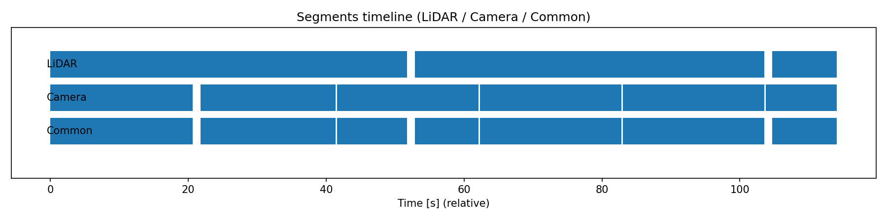

# Multi-Sensor Dataset Pipeline — Summary & Evidence

## Overview
An end-to-end pipeline was implemented to convert ROS2 MCAP logs (camera + LiDAR + TF) into a lightweight **nuScenes-lite** dataset. The pipeline inspects the log, enforces timing constraints during chunking, exports scene folders, validates integrity, auto-tags scenes, and exposes a PyTorch Dataset.

---

## Task 1 — Chunking rationale (20 s vs. 40 s)
Using **sensor timestamps** and a **150 ms** max inter-message gap, gap analysis reported median gaps ≈ **103.6 ms** with **spikes up to ~1.14 s** for both sensors. As a result, the **common camera ∩ LiDAR segments** are limited to ≈ **20.6 s** and ≈ **19.6 s**; **no ≥ 40 s** common segment exists under the 150 ms constraint. The splitter therefore emitted **three valid ≈ 20.5 s chunks** rather than fabricating longer segments.  
*Evidence: `01a_dump_gaps.py` / `01b_plot_gaps.py`; the split manifest lists three ~20.5 s chunks.*

> **Note:** All thresholds and the time base are configurable via YAML (`min_length_s`, `max_gap_ms`, `time_source = sensor | log`).

  

<em>Timeline of valid segments per sensor and their common overlap. No shared segment ≥ 40s exists under current gap constraints.</em>

---

## Task 2 — Dataset format & purpose

**Chosen format:** a lightweight nuScenes-lite layout per scene. The builder (`02_build_dataset.py`) writes:

- `images/left/<ts>.jpg` — JPEG frames  
- `lidar/<ts>.bin` — LiDAR as float32 `[N,4]` (x, y, z, intensity)  
- `poses/<ts>.json` — optional per-frame 4×4 pose  
- `calib/{camera_left.json, T_<cam>__<lidar>.json}` — intrinsics and static extrinsics  
- `index/samples.json` — scene-level index with relative paths and timestamps

An optional global `manifest.parquet` lists samples across scenes for fast tabular filtering/analytics when datasets grow or move to object storage. **Training does not depend on this file**; it is produced for curation at scale.

### Why this format works
- **Simple and debuggable.** Plain folders, one JSON index per scene, and flat binaries keep I/O predictable and easy to inspect.
- **Efficient.** Point clouds are stored as raw float32 `[N,4]`; images are JPEG; pairing is done once during build time.
- **Low complexity.** No custom container formats or heavy dependencies are required for training.
- **Quality & validation.** Configuration is YAML-driven and a validator checks `samples.json`, file presence, decodability (image/LiDAR), and calib/pose consistency.
- **Scales cleanly.** The format supports training directly from per-scene folders, and an optional Parquet manifest (`manifest.parquet`) enables fast global filtering or analytics (e.g., with PyArrow or Polars) — without modifying the training layout.

### What the builder actually does (`02_build_dataset.py`)
1. **Reads config & chunk manifest** (`configs/build_dataset.yaml`, `out/chunks_demo.json`).
2. **Extracts intrinsics** from `camera_info` → `calib/camera_left.json`.
3. **Resolves static extrinsics** from `/tf_static` (e.g., `T_camera_frame__lidar_frame.json`).
4. **Streams each chunk window**: decodes camera JPEGs and LiDAR PointCloud2 to `.bin (float32 [N,4])`.
5. **Time pairing**: for each camera timestamp, pairs the nearest LiDAR within `pair_tolerance_ms=50` (configurable).  
   *(Optional)* applies a constant offset if needed.
6. **Pose per frame (optional)**: if a TF is available near the timestamp, writes `poses/<ts>.json` (4×4).
7. **Writes the scene index** `index/samples.json` with relative paths (image/lidar/pose) and calib refs.
8. **(Optional)** Appends a row per frame to **`out/dataset/manifest.parquet`** for global cataloging.

### Optional — Dataset validation (`03_validate_dataset.py`)

**Purpose.** Sanity-check the built dataset before training.

**What it checks**
- Per-scene structure: `images/`, `lidar/`, `poses/`, `calib/`, and `index/samples.json`.
- `samples.json`: exists, has frames, and all **relative paths** resolve on disk.
- Spot-checks N samples per scene:
  - Image decodes to `H×W×3`
  - LiDAR `.bin` is float32, shape `[N,4]`, finite values
  - Pose (if present) is a valid `4×4` matrix
- Calibration presence (`camera_left.json`, `T_*`).
- **Optional:** quick Parquet sanity check (`--check-parquet`) reading only `["scene_id","timestamp_ns"]`.

---

## Task 3 — PyTorch Dataset accessors

`MultiSensorNuScenesLite` loads the dataset produced in Task 2 and exposes, per sample:

- **Camera image:** `torch.Tensor [C, H, W]` (RGB)  
- **LiDAR point cloud:** `torch.Tensor [N, 4]` (x, y, z, intensity; variable length)  
- **Pose:** `torch.Tensor [4, 4]` or `None`  
- **Also provides:** `timestamp_ns`, `scene`, and calibration dicts (`intrinsics`, `static_extrinsics`)

### Batch contract
Using the provided `collate_default`, a batch has:
- `image` → `torch.Tensor [B, 3, H, W]`  
- `pointcloud` → `List[torch.Tensor [Ni, 4]]` (variable lengths)  
- `pose_T` → `List[torch.Tensor [4, 4] or None]`  
- `timestamp_ns` → `List[int]`, `intrinsics` / `static_extrinsics` → `List[dict]`, `scene` → `List[str]`

### How to use
    from src.multi_sensor_dataset import MultiSensorNuScenesLite, collate_default
    from torch.utils.data import DataLoader

    ds = MultiSensorNuScenesLite(root="out/dataset")  # reads per-scene index/samples.json
    dl = DataLoader(ds, batch_size=4, shuffle=True, num_workers=4, collate_fn=collate_default)
    batch = next(iter(dl))
    print(batch["image"].shape)          # [B, 3, H, W]
    print(batch["pointcloud"][0].shape)  # [N, 4]
    print(batch["pose_T"][0].shape if batch["pose_T"][0] is not None else None)

> **Data source used by the Dataset:** all paths/metadata come from **`scene_XXX/index/samples.json`**.  
> **`manifest.parquet` is not required** and is not consulted by the Dataset class.

---

## Auto-tagging (`04_make_tags.py`)
This tool derives **per-scene metadata** and **tags** to make large collections easy to filter.  
Outputs:
- Per-scene: `scene_XXX/tags.json`
- Global (optional): `out/dataset/tags.csv`, `out/dataset/tags.parquet`

### What it computes (from code)

- **Timing**
  - `paired_fps` ≈ `num_frames / duration_s` (rounded to 0.001 in JSON, and **tag** `fps~<x.y>` rounded to 0.1).
  - `median_dt_ms`, `p95_dt_ms` from consecutive timestamp diffs.

- **Camera**
  - Reads `calib/camera_left.json` → `width`, `height`, and `distortion_model` (e.g., `plumb_bob`).
  - **Tags**: `res=<W>x<H>`, `cam_model=<distortion>` (only if present).

- **Extrinsics**
  - Presence of any `calib/T_*.json` (e.g., `T_camera_frame__lidar_frame.json`).
  - **Tags**: `extrinsics` (present) or `no-extrinsics`.

- **Pose**
  - Counts frames with a `poses/<ts>.json` file.
  - `pose_coverage` = `frames_with_pose / num_frames`.
  - Samples up to `--max-poses-to-sample` pose files and records `pairs_sampled` (IDs in each pose JSON).
  - **Tags**: `pose` (present) or `no-pose`.

- **LiDAR density**
  - For each `lidar/<ts>.bin`, estimates points by `filesize // 16` (each point is 4×float32).
  - Computes `avg/min/max` points per frame.
  - **Buckets** (tag):
    - `dense-lidar` if `avg_pts >= 120_000`
    - `mid-lidar` if `avg_pts >= 60_000`
    - `sparse-lidar` otherwise

### Why these tags (filtering rationale)

- **pose / extrinsics** → ensures scenes are usable for **sensor fusion** and **ego-motion** tasks.  
- **res=WxH / cam_model=…** → controls **input shape** and **undistortion** choices; compatible with model configs.  
- **fps~x.y** → sequences with consistent cadence benefit **temporal** and **VIO/SLAM** training.  
- **dense-/mid-/sparse-lidar** → rough proxy for **scene richness** and **compute cost** (useful for balanced sampling).

---

## CI & reproducibility
- **CI (lint + import):** a lightweight GitHub Actions workflow runs Black and a smoke import on every PR/commit.
- **Dataset Smoke (manual):** an on-demand workflow accepts a small MCAP URL, runs **gap analysis → split → build → validate → tag**, and uploads artifacts (`out/figs`, `manifest.parquet`, `tags.csv`, one `samples.json`). Large/private logs are intended to run locally or on a self-hosted runner.

---

## Scaling & storage plan

**Today:** train from the per-scene nuScenes-lite folders on local disk (the Dataset reads `index/samples.json`).  
**If remote is needed:** store **bundled scenes** in object storage (e.g., `scene_<id>.tar` or WebDataset shards) to avoid small-file overhead; keep a small **catalog** at the root (`manifest.parquet`, `tags.csv/parquet`) to filter/select which scenes to fetch.  
**Workflow:** filter with the catalog → download only the selected scene bundles → extract → train (no code changes).  
**IDs & evolution:** use stable scene IDs (e.g., `scene_<start_ns>`) and **append-only** writes; if the volume grows, promote the catalog to Delta/Iceberg later without changing the per-scene training layout.

---

## Future work
- **Team alignment.** Agree on stable scene IDs, tagging scheme, and acceptance gates (e.g., min segment length, max gap, pairing tolerance).  
- **One-click runs.** Keep the manual GitHub Action as a smoke test; later, orchestrate the same stages end-to-end (Step Functions/ECS) with clear input/output contracts.  
- **Scale & storage.** Store scenes as bundled objects in S3 (cost-friendly), keep a small Parquet/CSV catalog for selection, and upgrade to Iceberg later if needed.  
- **Productization.** Extend to multi-camera, optional LiDAR compression/sharding, and add lightweight drift/quality signals to the catalog to trigger retraining.

---

## Evidence from this run
- Recording ≈ **114.0 s**; ≈ **1087** camera / ≈ **1081** LiDAR messages.
- Gaps (sensor time): median ≈ **103.6 ms**; **max ≈ 1.14 s** → no ≥ 40 s common segment at 150 ms.
- Output: **3 scenes ~20.5–20.6 s**; **596 paired samples** total; validation passed; tags generated; global Parquet manifest written.
See full commands, console output, and artifacts: **[**EVIDENCE.md**](EVIDENCE.md)**.